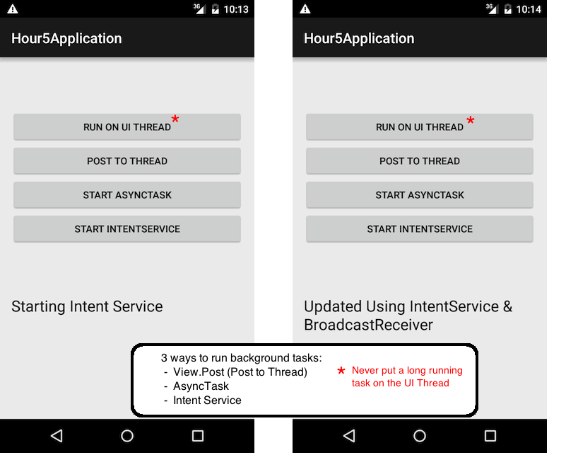

# Hour 5 - Responsive Apps: Running in the Background

Example Application shows 3 methods to run a long running task in the background.

###From Hour 5:
**The UI Thread**

*When an app starts and an Activity is launched, the display of widgets on the screen and the interaction with those widgets is handled by the Android operating system. A single thread is used to handle all interactions with the user interface. That means that any action running on that thread will block other user interface interactions. For example, if the user clicks a button and a task that requires 5 seconds to run, the user will not be able to interact with the user interface during that time.  That will lead to a dreaded ANR error – App not responding! If that occurs, the user is given the option to wait or stop the app.  Because this single thread handles all the interaction with the Android UI Toolkit, it is known as the UI thread.*

*You should not perform long running tasks on the UI thread.*

**Building responsive apps means not blocking the UI thread.**

**MainActivity.java** demonstrates what happens when you do a long running task on the UI thread and shows 3 ways to handle that task in the background.
The proper ways are to use View.post() and start a thread, use an AsyncTask, and use an IntentService with a BroadcastReceiver.

Hour 5 App Screenshot with notes:

